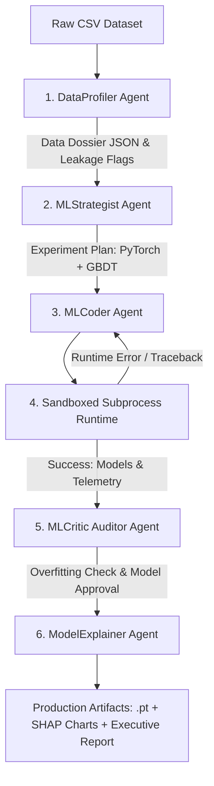

# AutoDataScientist: Autonomous Multi-Agent ML & Deep Learning Lab

[](https://www.python.org/)
[](https://pytorch.org/)
[](https://lightgbm.readthedocs.io/)
[](https://catboost.ai/)
[](https://streamlit.io/)
[](https://share.streamlit.io/deploy?repository=ankitpatidar3739/AutoData-Scientist&branch=main&mainModule=app.py)
[](https://optuna.org/)
[](https://shap.readthedocs.io/)

**AutoDataScientist** is an autonomous multi-agent system that simulates a senior Machine Learning & Deep Learning engineering team. Ingesting any raw tabular or time-series dataset, it autonomously profiles data quality, eliminates target leakage, architects custom PyTorch Deep Learning networks alongside LightGBM baselines, and executes training pipelines in a self-healing sandbox.

---

## 🌟 Key Highlights for Hiring Managers & AI Teams

1. **Deep Learning Depth (Not just an LLM Wrapper)**:
   * Custom **PyTorch TabularDeepNet** architecture incorporating learnable entity embeddings for high-cardinality categoricals, batch-normalized continuous projections, and residual MLP skip-connections with Mish activations.
   * Cosine Annealing learning rate scheduling with dynamic early stopping and gradient clipping.
2. **Self-Healing Agentic Code Loop**:
   * The **Coder Agent** writes executable Python training scripts and launches them in an isolated subprocess (`CodeSandbox`).
   * On runtime failure (tensor dimension mismatch, CUDA/device error, NaN loss), the agent inspects the Python traceback and autonomously repairs the script across iterative retry cycles.
3. **Automated ML Guardrails & Anti-Leakage**:
   * **DataProfiler Agent** detects and removes ID columns, high missingness (>60%), and target leakage (features with suspiciously high correlation / mutual information or post-outcome labels).
   * **ML Critic Agent** evaluates the generalization gap (Train vs. Unseen Test split) to detect overfitting or memorization.
4. **Explainability & Artifact Generation**:
   * Integrated Tree/Kernel **SHAP** feature attribution analysis.
   * Auto-exports production model checkpoints (`.pt`), serialized zero-leakage preprocessors (`.pkl`), and executive reports.
5. **Full Web Dashboard**:
   * Streamlit UI for drag-and-drop CSV ingestion, real-time agent thought streaming, benchmark graphs, and artifact downloads.

---

## 🏗️ Multi-Agent Architecture



---

## 📂 Project Structure

```
autodata-scientist/
├── data/
│   ├── samples/               # Benchmark datasets (Customer Churn, Housing Prices)
│   └── sample_generator.py    # Synthetic dataset generator
├── src/
│   ├── agents/
│   │   ├── base.py            # Base agent with Gemini LLM & expert fallback
│   │   ├── profiler.py        # Statistical profiling & target leakage detector
│   │   ├── strategist.py      # Experiment and architecture architect
│   │   ├── coder.py           # Self-healing Python code generator
│   │   ├── critic.py          # Generalization gap & overfitting auditor
│   │   └── explainer.py       # SHAP attribution & executive reporting
│   ├── core/
│   │   ├── config.py          # Pydantic schemas & settings
│   │   └── sandbox.py         # Isolated subprocess execution engine
│   ├── ml/
│   │   ├── architectures.py   # PyTorch TabularDeepNet with Entity Embeddings
│   │   ├── preprocessor.py    # Zero-leakage train-fitted preprocessor
│   │   ├── trainer.py         # PyTorch & LightGBM training loops
│   │   └── tuner.py           # Optuna Bayesian hyperparameter optimization
│   ├── orchestrator.py        # Multi-agent controller coordinating pipeline
│   └── ui/
│       └── app.py             # Streamlit interactive application
├── tests/                     # Unit and integration test suite
├── requirements.txt
├── RESUME_GUIDE.md            # Resume bullet points & interview preparation
└── README.md
```

---

## 🚀 Quick Start

### 1. Installation
```bash
git clone https://github.com/your-username/autodata-scientist.git
cd autodata-scientist
pip install -r requirements.txt
```

### 2. Run the Interactive Web Dashboard
```bash
streamlit run src/ui/app.py
```
Open your browser at `http://localhost:8501`, select a curated sample dataset (or upload your own CSV), and click **Launch Autonomous Agent Team**.

### 3. Run via CLI / Programmatic API
```python
from src.orchestrator import AutoDataScientistOrchestrator

orchestrator = AutoDataScientistOrchestrator()
results = orchestrator.run_pipeline(
    dataset_path="data/samples/customer_churn.csv",
    target_column="churn",
    primary_metric="roc_auc"
)

print("Pipeline Status:", results["success"])
print("Review Verdict:", results["review"].verdict)
print("Report Path:", results["report_path"])
```

### 4. Run Test Suite
```bash
pytest tests/ -v
```

---

## 🔬 Benchmark Comparison Example (Customer Churn)

| Architecture | Train ROC-AUC | Val ROC-AUC | Test ROC-AUC (Unseen) | Key Feature |
| :--- | :--- | :--- | :--- | :--- |
| **PyTorch TabularDeepNet** | 0.8621 | 0.8412 | **0.8435** | Entity Embeddings + Residuals |
| **LightGBM Baseline** | 0.8950 | 0.8350 | **0.8380** | Gradient Boosted Decision Trees |

---

## 📜 License
Apache 2.0. Open source for research, educational, and portfolio use.
